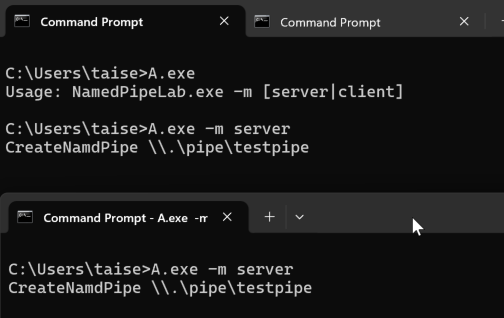
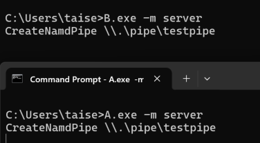
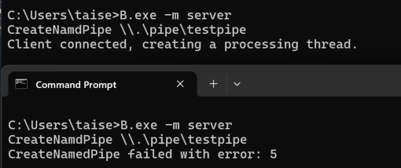
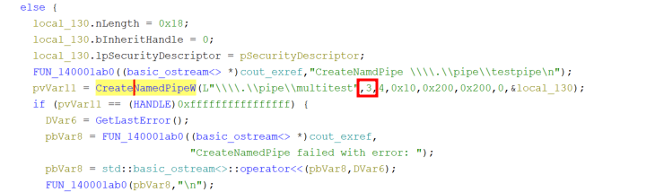
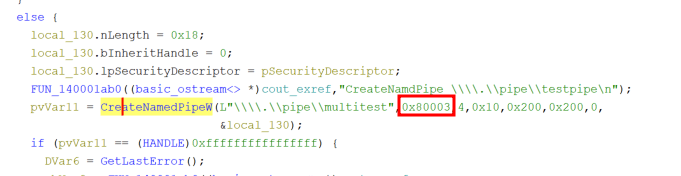
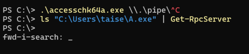

# 名前付きパイプの解析 その1

初めて名前付きパイプを触ってみたので、一旦メモがてら書き起こす。

まずこのレポートを読んだ。
https://hackerone.com/reports/1019891

つまるところ、任意のユーザが`\\.\pipe\MYSQL`と言う名前のパイプインスタンスを作成可能な状態であったこと、MYSQL.exeが作成するより前に`\\.\pipe\MYSQL`と言う名前のパイプが存在しても、エラーが起こらない設定(`FILE_FLAG_FIRST_FLAG_INSTANCE`)になっていたことが問題っぽい。

## 名前付きパイプサーバ

一旦どう言う設定だと脆弱になるのか確認したいので、最低限実装してみる。

```cpp
void StartServer() {
    HANDLE hPipe = INVALID_HANDLE_VALUE;
    BOOL   fConnected = FALSE;
    HANDLE hThread = NULL;
    LPCTSTR lpszPipename = TEXT("\\\\.\\pipe\\testpipe");
    DWORD  dwThreadId = 0;

    std::cout << "CreateNamdPipe" <<  lpszPipename;
    hPipe = CreateNamedPipe(
        lpszPipename,
        PIPE_ACCESS_DUPLEX, // read/write access
        PIPE_TYPE_MESSAGE | 
        PIPE_WAIT,
        16,
        BUFSIZE,
        BUFSIZE,
        0,
        NULL // default seurity attribute
    );

    if (hPipe == INVALID_HANDLE_VALUE) {
       std::cout << "CreateNamedPipe failed with error: " << GetLastError() << "\n";
       DeleteFile(lpszPipename);
       return;
    }

    fConnected = ConnectNamedPipe(hPipe, NULL)?
        TRUE : (GetLastError() == ERROR_PIPE_CONNECTED);

    if (fConnected) {
        std::cout << "Client connected, creating a processing thread.\n";
        // 接続後の処理が続く
    } else {
        std::cout << "ConnectNamedPipe failed with error: " << GetLastError() << "\n";
    }

    DisconnectNamedPipe(hPipe);
    CloseHandle(hPipe);
    DeleteFile(lpszPipename);
    return;
}
```

確認結果は以下



続いて、`FILE_FLAG_FIRST_PIPE_INSTANCE`フラグを設定していない上記の実行ファイル(A.exe)と、フラグを設定するように変更した実行ファイル(B.exe)を用意する。

以下の手順で試す。

- 1. A.exeを実行後、B.exeを実行
- 2. B.exeを実行後、A.exeを実行
- 3. A.exeを実行後、A.exeを実行
- 4. B.exeを実行後、B.exeを実行


1,4が失敗する。なぜなら、B.exeは`FILE_FLAG_FIRST_PIPE_INSTANCE`が設定されているため、同じ名前の名前付きパイプインスタンスが存在するとエラーになるはず。

### A->A

### A->B

### B->A

### B->B


予想どおり、`FILE_FLAG_FIRST_PIPE_INSTANCE`が設定されている場合は、同じ名前の名前付きパイプインスタンスがあれば作成に失敗する。

`FILE_FLAG_FIRST_PIPE_INSTANCE`が設定されていない場合、悪意ある実行ファイルが先に名前付きパイプインスタンスを作成していたとしても、正規のアプリも名前付きパイプインスタンスを作成できる。
でも、名前付きパイプはFIFOなので、悪意のある名前付きパイプインスタンスが優先されるのでMitM攻撃ができてしまう。

## 確認したい
どうやって？
Ghidraで無理やりCreateNamedPipeの第二引数を見る。
何も設定されてなさそうであれば、わんちゃんMitMに脆弱。第四引数の値も大切。

`FILE_FLAG_FIRST_PIPE_INSTANCE`

### A.exe



### B.exe




## TODO

`FILE_CREATE_PIPE_INSTANCE`権限がよくわかってない。


こんな感じで撮れないことがあるのが気になる。
静的解析で`NamedPipeOpen`が呼ばれているか見るのが良さそう。


